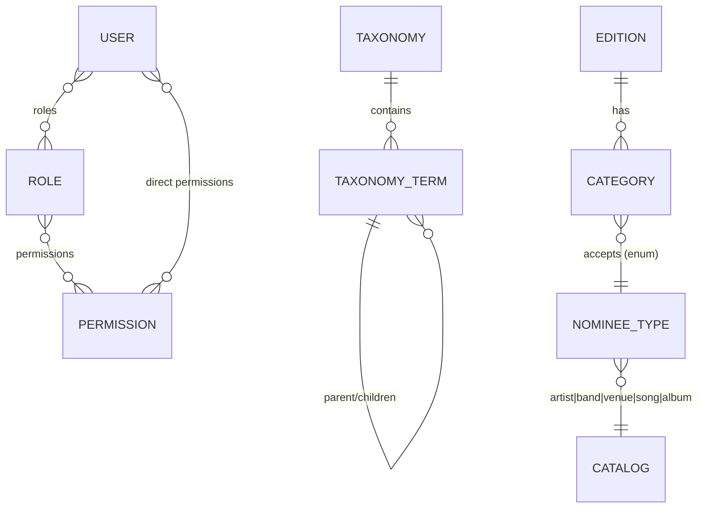
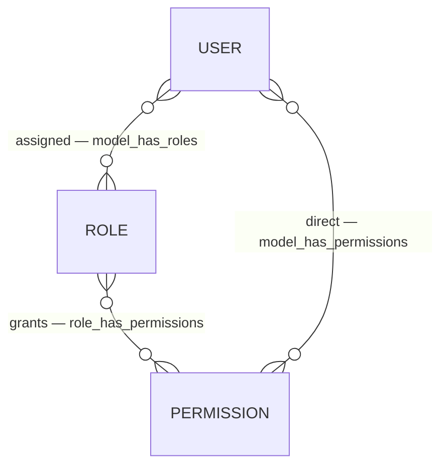
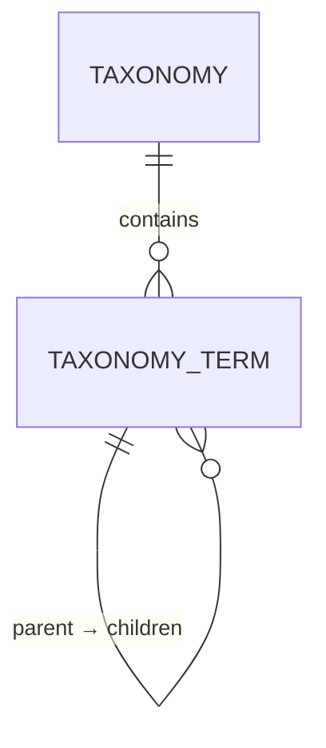
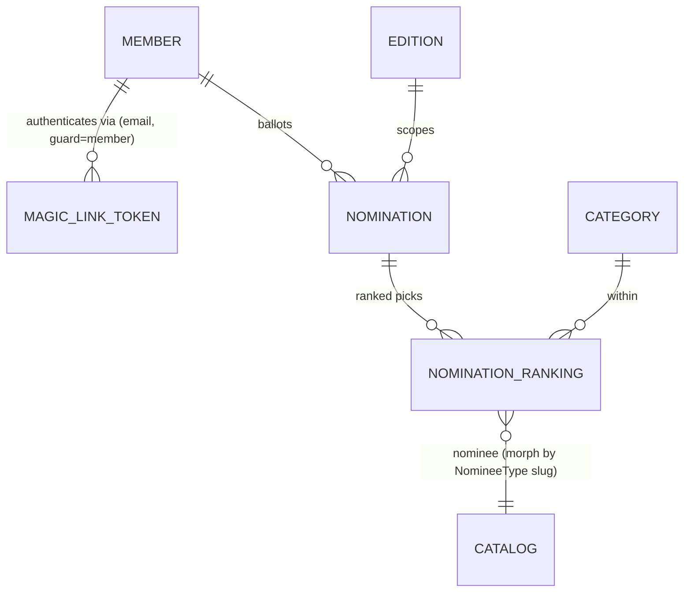
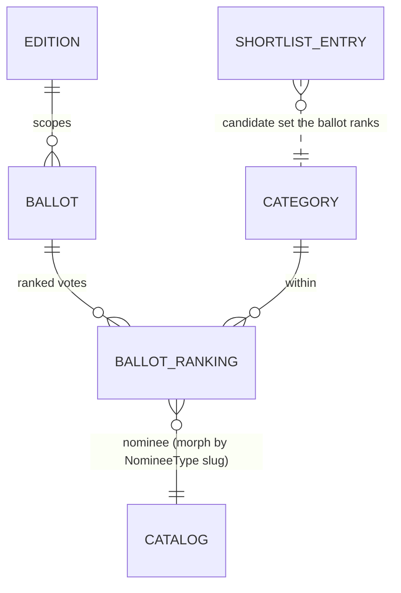

# Domain Model

Every **persistent entity** in `rominas-api`, grouped by module, with its key fields and the
relationships between entities. Models live at `app/Modules/<Module>/…/Model/`.

Only **implemented** modules are documented in full; planned modules are listed at the end so the
picture stays complete. Keep this file in sync whenever an entity is added or changed.

## Module overview

| Module | Entities | Kind |
| --- | --- | --- |
| [Access control](#access-control--users-roles-permissions) (`Users`, `Roles`, `Permissions`) | User, Role, Permission | Admin accounts & authorization |
| [Taxonomies](#taxonomies) | Taxonomy, TaxonomyTerm | Classification vocabulary |
| [Editions](#editions) | Edition | Yearly award edition + lifecycle |
| [Categories](#categories) | Category | Award categories, scoped to an edition |
| [Catalog](#catalog) | Artist, Band, Venue, Song, Album | Nominatable entities |
| [Academy](#academy) | Member, Nomination, NominationRanking, MemberProposal | Participant accounts, ranked nominations, member proposals |
| [Behavioural modules](#behavioural-modules-no-persistent-entities) (`Auth`, `Delivery`, `Shared`) | MagicLinkToken | Behaviour + the magic-link token store |

> **Catalog entities are standalone** — there are no relationships between Artist/Band/Venue/Song/
> Album (nor to Categories) yet. A category names the *type* of catalog entity it accepts via the
> `NomineeType` enum; the actual nominee↔category links arrive with the `Academy`/`Voting` modules.

---

## Access control — `Users`, `Roles`, `Permissions`

Admin accounts and authorization, built on [spatie/laravel-permission](https://spatie.be/docs/laravel-permission)
and Laravel Sanctum. `Role` and `Permission` extend the Spatie base models; `User` is the
authenticatable admin account. The full auth story (guards, tokens, the wildcard-permission scheme)
is in [access-control.md](access-control.md).

**User** — `app/Modules/Users/Model/User.php`

| Field | Notes |
| --- | --- |
| `name`, `email`, `password` | `password` is `hashed`; `email` unique |
| `email_verified_at` | nullable datetime |

Traits: `HasRoles`, `HasApiTokens` (Sanctum), `HasPermissionTargets`, `Notifiable`. `isSuperAdmin()`
checks the configured `super_admin_role`, which bypasses every gate via `Gate::before`
(`app/Providers/AuthServiceProvider.php`).

**Role** — `app/Modules/Roles/Model/Role.php` — Spatie role (`name`, `guard_name`). Seeded set:
`super_admin`, `admin`, `custodian`, `fraud_monitor` (`database/seeders/RoleSeeder.php`).
**Permission** — `app/Modules/Permissions/Model/Permission.php` — Spatie permission (`name`,
`guard_name`).

**Relationships**

- `User` ⇄ `Role` (many-to-many, pivot `model_has_roles`).
- `Role` ⇄ `Permission` (many-to-many, pivot `role_has_permissions`).
- `User` ⇄ `Permission` (direct, many-to-many, pivot `model_has_permissions`).

---

## Taxonomies

A reusable classification vocabulary. A **Taxonomy** (e.g. *Genre*, *Region*, *Tag*) owns a set of
**TaxonomyTerms**; terms may be hierarchical and carry SEO/visibility metadata. Ported from `door`.

> **Not yet attached to anything.** Catalog entities carry no taxonomy pivots in the current phase —
> genre/region tagging of artists/songs/venues will be added when the domain calls for it.

**Taxonomy** — `app/Modules/Taxonomies/Model/Taxonomy.php`

| Field | Notes |
| --- | --- |
| `name` | unique |
| `hierarchical` | bool — whether terms may nest |
| `allows_multiple` | bool — whether an associated model may hold one term or many |

**TaxonomyTerm** — `app/Modules/Taxonomies/Model/TaxonomyTerm.php`

| Field | Notes |
| --- | --- |
| `taxonomy_id` | FK → Taxonomy (`cascadeOnDelete`) |
| `parent_id` | nullable self-FK (`nullOnDelete`) |
| `name`, `slug` | unique **per taxonomy** (`(taxonomy_id, name)` / `(taxonomy_id, slug)`); slug auto-generated |
| `meta` | JSON, cast to a `TaxonomyTermMeta` value object (`seo`, `hidden`) |

**Relationships** — `Taxonomy` → many `TaxonomyTerm` (`terms()`); `TaxonomyTerm` → one `Taxonomy`
(`taxonomy()`), self-referencing `parent()` / `children()`.

---

## Editions

A yearly awards edition and its lifecycle. Only **one non-archived edition** may exist at a time.
The lifecycle state machine and the six-datetime timeline are documented in full in
[edition-lifecycle.md](edition-lifecycle.md).

**Edition** — `app/Modules/Editions/Model/Edition.php`

| Field | Notes |
| --- | --- |
| `name` | unique |
| `slug` | unique, auto-generated from `name` |
| `starts_at` | overall edition window start (mandatory) |
| `nominations_start_at` | academy nominations open (mandatory) |
| `nominations_end_at` | academy nominations close (mandatory) |
| `voting_start_at` | public voting opens (mandatory) |
| `voting_end_at` | public voting closes (mandatory) |
| `ends_at` | overall edition window end (mandatory) |
| `status` | `EditionStatus` enum, default `draft` |
| `academy_vote_weight` | result weight of the academy round, default `60` (read by `Scoring`) |
| `public_vote_weight` | result weight of public voting, default `40` (read by `Scoring`) |

All six datetimes are **strictly ordered**: `starts_at < nominations_start_at < nominations_end_at
< voting_start_at < voting_end_at < ends_at`, enforced by chained `after:` rules in
`Create`/`UpdateEditionRequest`.

**Enum** — `EditionStatus` (`Editions/Enums`): `draft` → `invitations_sent` → `nominations_open`
→ `nominations_closed` → `voting_open` → `voting_closed` → `committee_review` → `results_published`
→ `archived` (linear; `archived` is terminal). `isActive()` = not `archived`.

**Relationships** — `Edition` → many `Category` (via `Category::edition()`).

**Invariant** — at most one edition with `status != archived`, enforced in `CreateEditionAction`
(422 on a second active edition).

---

## Categories

Award categories (e.g. *Best Album*), scoped to an edition and **typed**: each declares which
catalog entity type it accepts.

**Category** — `app/Modules/Categories/Model/Category.php`

| Field | Notes |
| --- | --- |
| `edition_id` | FK → Edition (`cascadeOnDelete`) |
| `name`, `slug` | unique **per edition** (`(edition_id, name)` / `(edition_id, slug)`); slug auto-generated |
| `nominee_type` | `NomineeType` enum — the catalog entity type this category competes |
| `position` | int — display ordering |
| `description` | nullable |

**Enum** — `NomineeType` (`Catalog/Enums/NomineeType.php`): `artist` \| `band` \| `venue` \| `song`
\| `album`. Slug-backed (never the class FQN); `modelClass()` resolves the slug to its Eloquent
model (morph-map style) and `label()` gives a display name.

**Relationships** — `Category` → one `Edition` (`edition()`). The `nominee_type` links a category to
a catalog **model class** (not a row) via `NomineeType::modelClass()`.

**Rules** — `edition_id` is required on create and **immutable on update** (`CategoryDataFactory`
has separate `fromCreateRequest`/`fromUpdateRequest`); `nominee_type` validated with
`Rule::enum(NomineeType::class)`. Points-per-rank / scoring config is **not** on Category — it
belongs to the planned `Scoring` module.

---

## Catalog

The nominatable entities. Each is a **flat, standalone** per-entity submodule (`Catalog/Artist/…`,
`Catalog/Band/…`, …) with the same skeleton; there are **no relationships between them yet**
(no band membership, no song→album) and no taxonomy pivots.

Every entity shares the same shape:

| Field | Notes |
| --- | --- |
| `name` | required |
| `slug` | unique, auto-generated from `name` (`booted()` saving hook) |
| `description` | nullable |

**Entities** — `Artist`, `Band`, `Venue`, `Song`, `Album` (`app/Modules/Catalog/<Entity>/Model/`).
Tables: `artists`, `bands`, `venues`, `songs`, `albums`. Each has full CRUD under `/admin/<entity>s`,
a policy gating on the `<entity>s` permission, and a typed QueryBuilder (search/sort + permission
scoping). The `NomineeType` enum (see [Categories](#categories)) maps its slugs to these models.

> Type-specific scalar fields (e.g. Venue `city`, Album `release_year`) and inter-entity
> relationships are intentionally deferred — add them when a concrete requirement lands.

---

## Academy

Academy-member accounts, their passwordless auth, and their **ranked nominations**. A **Member** is a
participant account on its own `member` Sanctum guard (never the admin `web` guard); members log in
via magic link. Admins manage the roster; invitations are emailed when an edition enters
`invitations_sent`. Members then rank nominees per category. Member proposals are handled here too;
the per-category voting **shortlist** — generated on demand by admins once nominations close — is a
sibling submodule ([Shortlist](#shortlist)).

**Member** — `app/Modules/Academy/Member/Model/Member.php`

| Field | Notes |
| --- | --- |
| `name` | required |
| `email` | unique |
| `status` | `MemberStatus` enum — `invited` \| `active` \| `suspended` |
| `email_verified_at` | nullable; set on first magic-link login |
| `invited_at` | nullable; set when an invitation is sent |
| `activated_at` | nullable; set on first successful login |

Authenticatable (`HasApiTokens`, `Notifiable`); **passwordless** (no password column). `#[UsePolicy(MemberPolicy)]`
gates admin-side CRUD on the `members` permission. `MemberQueryBuilder` adds search/sort +
`filterByStatus()`. A member becomes `active` on first magic-link verify; `suspended` members are
barred from logging in. Full auth story in [access-control.md](access-control.md).

**Nomination** — `app/Modules/Academy/Nomination/Model/Nomination.php` — a member's ballot for one
edition (one row per member+edition).

| Field | Notes |
| --- | --- |
| `member_id` | FK → Member (`cascadeOnDelete`) |
| `edition_id` | FK → Edition (`cascadeOnDelete`) |
| `status` | `NominationStatus` enum — `draft` \| `submitted` |
| `submitted_at` | nullable; set when finalized |

Unique `(member_id, edition_id)`. `belongsTo` Member/Edition, `hasMany` rankings.

**NominationRanking** — `app/Modules/Academy/Nomination/Model/NominationRanking.php` — one ranked pick.

| Field | Notes |
| --- | --- |
| `nomination_id` | FK → Nomination (`cascadeOnDelete`) |
| `category_id` | FK → Category (`cascadeOnDelete`) |
| `rank` | tinyint, 1 = top (order → points, later, in `Scoring`) |
| `nominee_type` | `NomineeType` enum slug — the polymorphic morph alias |
| `nominee_id` | the Catalog row id |

Unique `(nomination_id, category_id, rank)` and `(nomination_id, category_id, nominee_type,
nominee_id)`. `nominee()` is a `morphTo` resolved via the **morph map** (`AppServiceProvider`, mapping
each `NomineeType` slug → its Catalog model, so nominee rows store the slug not a FQN). Members rank
from the **full Catalog** of the category's type; gating (open window) and the submit rule (every
category has exactly 5) live in the Nomination actions — see the Academy nominations flow in
[access-control.md](access-control.md#2c-ranked-nominations-the-nomination-module).

**MemberProposal** — `app/Modules/Academy/MemberProposal/Model/MemberProposal.php` — a standing
proposal, made by a member, to add a future academy member. Not edition-scoped (a running pool).

| Field | Notes |
| --- | --- |
| `proposed_by_member_id` | FK → Member (`cascadeOnDelete`) — the proposer |
| `name`, `email` | the proposed person |
| `reason` | nullable — the proposer's justification |
| `status` | `MemberProposalStatus` enum — `pending` \| `approved` \| `rejected` |
| `member_id` | nullable FK → Member — the invited Member created on approval |
| `reviewed_by_user_id` | nullable FK → User — the admin who reviewed |
| `reviewed_at`, `review_note` | nullable — review metadata |

Members submit/list/withdraw their own proposals (guard `member`, anytime); admins review under the
`memberProposals` permission — **approving creates an invited Member** (reusing `CreateMemberAction`),
feeding the invitation flow. See [access-control.md](access-control.md#2d-member-proposals).

**MagicLinkToken** — `app/Modules/Auth/MagicLink/Model/MagicLinkToken.php` (guard-agnostic; see the
Behavioural modules note).

### Shortlist

The bridge from academy nominations to public voting. Once nominations close, admins **generate** each
category's shortlist — the top 5 nominees, by summed academy points — which becomes the frozen candidate
list the public ballot ranks. Generation is an **explicit, on-demand admin action** (not an automatic
side effect of the `nominations_closed` transition): per-category or bulk (all categories in the edition).
It may run — and re-run, replacing prior entries — only while the edition is `nominations_closed`; once
voting opens the shortlist is locked.

Points use the confirmed academy curve, `points = 6 − rank` (rank 1 → 5 pts … rank 5 → 1), owned by
`Rominas\Scoring\RankPoints::forRank()` (also used by the `Scoring` module, reused by Voting).
Nominees are ordered points desc, ties broken by nominee id; genuine ties at the cutoff (and any other
manual edit) are settled by admins via the **review/adjust flow**: `GET …/candidates` returns the full
ranked candidate pool and `PUT …/shortlist` replaces a category's shortlist with the admin's final
ordered nominees (see [access-control.md](access-control.md#2e-nominee-shortlist)).

**ShortlistEntry** — `app/Modules/Academy/Shortlist/Model/ShortlistEntry.php` — one finalist on a
category's shortlist.

| Field | Notes |
| --- | --- |
| `edition_id` | FK → Edition (`cascadeOnDelete`) |
| `category_id` | FK → Category (`cascadeOnDelete`) |
| `nominee_type` | `NomineeType` enum slug — the polymorphic morph alias |
| `nominee_id` | the Catalog row id |
| `points` | nullable — summed academy points; on a manual adjust, re-derived (0 if the nominee had no academy nominations) |
| `position` | 1 = top of the shortlist |

Unique `(edition_id, category_id, nominee_type, nominee_id)` and `(edition_id, category_id, position)`.
`belongsTo` Edition/Category; `nominee()` is a `morphTo` resolved through the morph map. Generation lives
in `GenerateCategoryShortlistAction` (one category) and `GenerateEditionShortlistsAction` (bulk); the
admin endpoints and `shortlists` permission are in [access-control.md](access-control.md#2e-nominee-shortlist).

---

## Voting

Accountless public voting. A member of the public requests a one-time link by email, ranks the
shortlisted nominees, and votes once. There is **no account and no guard** — possession of the (hashed)
link token is the authorization, checked in application code. Personal data is pseudonymized: only HMAC
hashes of the email and IP are stored (never plaintext), keyed by a stable `voting.pepper`
(`config/voting.php`). Voting reads the [Shortlist](#shortlist) as the candidate set and stores ranks
only; points/weighting are a later `Scoring`/`Results` concern.

**Ballot** — `app/Modules/Voting/Model/Ballot.php` — one voter's ballot/identity/link for an edition.

| Field | Notes |
| --- | --- |
| `edition_id` | FK → Edition (`cascadeOnDelete`) |
| `email_hash` | HMAC-SHA256 of the normalized email — the pseudonymized identity (no plaintext) |
| `token_hash` | SHA-256 of the single-use link token (**unique**); the plaintext token only leaves by email |
| `status` | `BallotStatus` enum — `issued` \| `submitted` |
| `expires_at` | link expiry (set to the edition's `voting_end_at`) |
| `submitted_at` | nullable; set when the ballot is cast |
| `ip_hash` | nullable; HMAC of the submitter IP, captured at submit for `FraudMonitoring` |

Unique `(edition_id, email_hash)` → **one link, ever, per email per edition**. `belongsTo` Edition;
`hasMany` rankings. `BallotQueryBuilder` adds `forEdition` / `byEmailHash` / `byTokenHash` / `issued`.
`BallotStatus` is the lifecycle; `VoterHasher` (`Voting/Support/`) is the single pseudonymization helper.

**BallotRanking** — `app/Modules/Voting/Model/BallotRanking.php` — one ranked vote (mirrors
`NominationRanking`).

| Field | Notes |
| --- | --- |
| `ballot_id` | FK → Ballot (`cascadeOnDelete`) |
| `category_id` | FK → Category (`cascadeOnDelete`) |
| `rank` | 1 = favourite (order → points, later, in `Scoring`) |
| `nominee_type` | `NomineeType` enum slug — the polymorphic morph alias |
| `nominee_id` | the Catalog row id (must be on that category's shortlist) |

Unique `(ballot_id, category_id, rank)` and `(ballot_id, category_id, nominee_type, nominee_id)`.
`nominee()` is a `morphTo` via the app-wide morph map. Casting a ballot is a one-shot atomic submit
(`SubmitBallotAction`): each included category must rank **all** of its shortlisted nominees exactly once
(a full 1→N ordering, N = the category's shortlist size), and ≥1 category is required. The endpoints and
the accountless flow are in [access-control.md](access-control.md#2f-public-voting).

---

## Behavioural modules (no persistent entities)

- **`Auth`** (`app/Modules/Auth/`) — admin username/password login → Sanctum token
  (`POST /api/authenticate`), and logout (see [access-control.md](access-control.md)). Also hosts the
  **guard-agnostic magic-link primitive** (`Auth/MagicLink/`): the `MagicLinkToken` model (table
  `magic_link_tokens`, composite PK `(email, guard)`, hashed single-use token, 15-min TTL, 60s resend
  cooldown) plus `SendMagicLinkAction`/`VerifyMagicLinkAction` (resolve the account through the
  guard's own auth provider, so any participant guard reuses them) and a queued `SendMagicLinkJob`.
- **`Delivery`** (`app/Modules/Delivery/`) — transactional email behind a transport seam
  (SMTP active; Brevo ported as an opt-in alternative). An `action → PayloadFactory → service`
  pipeline driven by `config/delivery.php`; no stored models.
- **`Shared`** (`app/Modules/Shared/Concerns/`) — cross-module query-builder concerns
  (`QueryBuilderSearchableTrait`, `QueryBuilderSortableTrait`).
- **`Scoring`** (`app/Modules/Scoring/`) — the results engine; **computes on demand, persists nothing**
  (the future `Results` module owns the custodian-gated view/export and the publish-time snapshot). Per
  category it re-tallies each shortlisted nominee's academy points (submitted `NominationRanking`s) and
  public points (submitted `BallotRanking`s) via the `RankPoints` curve, **normalizes each class to a
  share of that class's own category total** (so the two scales — dozens of academy members vs. thousands
  of voters — become comparable), then weights by the **edition's own** `academy_vote_weight` /
  `public_vote_weight` (default 60 / 40): `finalScore = 0.6·academyShare + 0.4·publicShare` (0..1).
  Ranking uses an **exact integer key** (`wₐ·aᵢ·P + wₚ·pᵢ·A`) — never floats — with ties broken academy →
  public → nominee id; a category with no public votes renormalizes to academy 100%. Weights live on the
  edition; display precision in `config/scoring.php`.
  `ScoreCalculator` (pure, DB-free) holds the maths; `ComputeCategoryScoresAction` /
  `ComputeEditionScoresAction` wire the DB and cache per edition + status (inputs are frozen from
  `voting_closed` onward). Guarded to `voting_closed` / `committee_review` / `results_published`.

---

## Planned modules (not yet implemented)

Tracked in the ecosystem [`CLAUDE.md`](../../CLAUDE.md); each gets its own section here once built.

| Module | Planned entities / concern |
| --- | --- |
| `CriticsChoice` | `Critic` (separate authenticatable + guard), committee submissions |
| `Results` | Custodian-gated view/export of the computed `Scoring` results; publish-time frozen snapshot |
| `FraudMonitoring` | Near-real-time vote monitoring; vote cancellation (reason required, audited) |
| `Audit` | Audit trail across sensitive actions (greenfield — no `door` template) |
