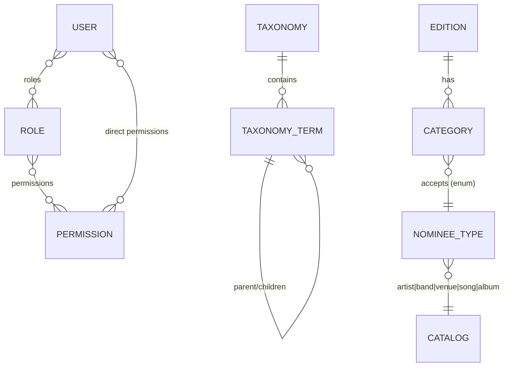
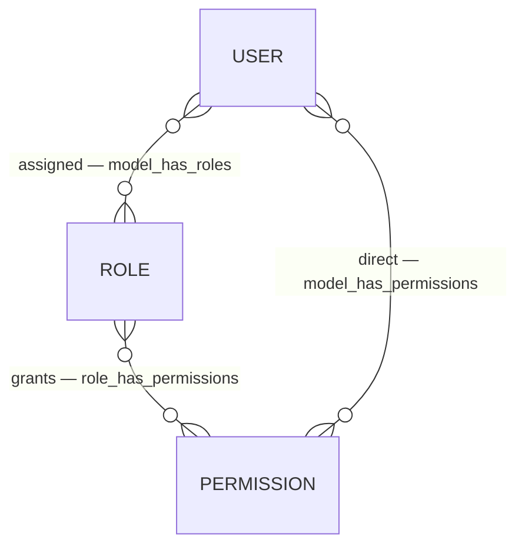
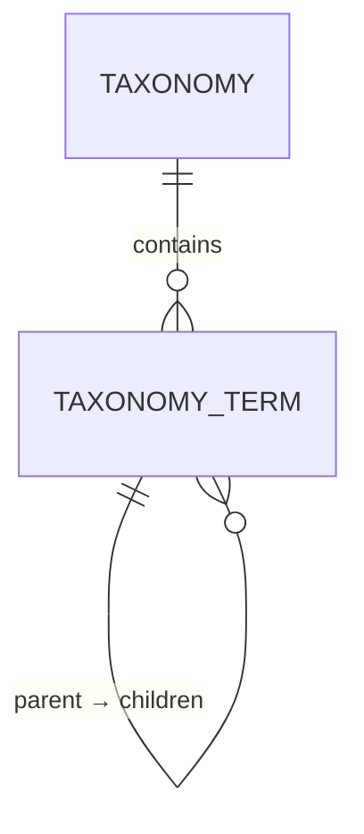

# Domain Model

Every **persistent entity** in `rominas-api`, grouped by module, with its key fields and the
relationships between entities. Models live at `app/Modules/<Module>/…/Model/`.

Only **implemented** modules are documented in full; planned modules are listed at the end so the
picture stays complete. Keep this file in sync whenever an entity is added or changed.

## Module overview

| Module | Entities | Kind |
| --- | --- | --- |
| [Access control](#access-control--users-roles-permissions) (`Users`, `Roles`, `Permissions`) | User, Role, Permission | Admin accounts & authorization |
| [Taxonomies](#taxonomies) | Taxonomy, TaxonomyTerm | Classification vocabulary |
| [Editions](#editions) | Edition | Yearly award edition + lifecycle |
| [Categories](#categories) | Category | Award categories, scoped to an edition |
| [Catalog](#catalog) | Artist, Band, Venue, Song, Album | Nominatable entities |
| [Behavioural modules](#behavioural-modules-no-persistent-entities) (`Auth`, `Delivery`, `Shared`) | — | Behaviour only |

> **Catalog entities are standalone** — there are no relationships between Artist/Band/Venue/Song/
> Album (nor to Categories) yet. A category names the *type* of catalog entity it accepts via the
> `NomineeType` enum; the actual nominee↔category links arrive with the `Academy`/`Voting` modules.

---

## Access control — `Users`, `Roles`, `Permissions`

Admin accounts and authorization, built on [spatie/laravel-permission](https://spatie.be/docs/laravel-permission)
and Laravel Sanctum. `Role` and `Permission` extend the Spatie base models; `User` is the
authenticatable admin account. The full auth story (guards, tokens, the wildcard-permission scheme)
is in [access-control.md](access-control.md).

**User** — `app/Modules/Users/Model/User.php`

| Field | Notes |
| --- | --- |
| `name`, `email`, `password` | `password` is `hashed`; `email` unique |
| `email_verified_at` | nullable datetime |

Traits: `HasRoles`, `HasApiTokens` (Sanctum), `HasPermissionTargets`, `Notifiable`. `isSuperAdmin()`
checks the configured `super_admin_role`, which bypasses every gate via `Gate::before`
(`app/Providers/AuthServiceProvider.php`).

**Role** — `app/Modules/Roles/Model/Role.php` — Spatie role (`name`, `guard_name`). Seeded set:
`super_admin`, `admin`, `custodian`, `fraud_monitor` (`database/seeders/RoleSeeder.php`).
**Permission** — `app/Modules/Permissions/Model/Permission.php` — Spatie permission (`name`,
`guard_name`).

**Relationships**

- `User` ⇄ `Role` (many-to-many, pivot `model_has_roles`).
- `Role` ⇄ `Permission` (many-to-many, pivot `role_has_permissions`).
- `User` ⇄ `Permission` (direct, many-to-many, pivot `model_has_permissions`).

---

## Taxonomies

A reusable classification vocabulary. A **Taxonomy** (e.g. *Genre*, *Region*, *Tag*) owns a set of
**TaxonomyTerms**; terms may be hierarchical and carry SEO/visibility metadata. Ported from `door`.

> **Not yet attached to anything.** Catalog entities carry no taxonomy pivots in the current phase —
> genre/region tagging of artists/songs/venues will be added when the domain calls for it.

**Taxonomy** — `app/Modules/Taxonomies/Model/Taxonomy.php`

| Field | Notes |
| --- | --- |
| `name` | unique |
| `hierarchical` | bool — whether terms may nest |
| `allows_multiple` | bool — whether an associated model may hold one term or many |

**TaxonomyTerm** — `app/Modules/Taxonomies/Model/TaxonomyTerm.php`

| Field | Notes |
| --- | --- |
| `taxonomy_id` | FK → Taxonomy (`cascadeOnDelete`) |
| `parent_id` | nullable self-FK (`nullOnDelete`) |
| `name`, `slug` | unique **per taxonomy** (`(taxonomy_id, name)` / `(taxonomy_id, slug)`); slug auto-generated |
| `meta` | JSON, cast to a `TaxonomyTermMeta` value object (`seo`, `hidden`) |

**Relationships** — `Taxonomy` → many `TaxonomyTerm` (`terms()`); `TaxonomyTerm` → one `Taxonomy`
(`taxonomy()`), self-referencing `parent()` / `children()`.

---

## Editions

A yearly awards edition and its lifecycle. Only **one non-archived edition** may exist at a time.
The lifecycle state machine and the six-datetime timeline are documented in full in
[edition-lifecycle.md](edition-lifecycle.md).

**Edition** — `app/Modules/Editions/Model/Edition.php`

| Field | Notes |
| --- | --- |
| `name` | unique |
| `slug` | unique, auto-generated from `name` |
| `starts_at` | overall edition window start (mandatory) |
| `nominations_start_at` | academy nominations open (mandatory) |
| `nominations_end_at` | academy nominations close (mandatory) |
| `voting_start_at` | public voting opens (mandatory) |
| `voting_end_at` | public voting closes (mandatory) |
| `ends_at` | overall edition window end (mandatory) |
| `status` | `EditionStatus` enum, default `draft` |

All six datetimes are **strictly ordered**: `starts_at < nominations_start_at < nominations_end_at
< voting_start_at < voting_end_at < ends_at`, enforced by chained `after:` rules in
`Create`/`UpdateEditionRequest`.

**Enum** — `EditionStatus` (`Editions/Enums`): `draft` → `invitations_sent` → `nominations_open`
→ `nominations_closed` → `voting_open` → `voting_closed` → `committee_review` → `results_published`
→ `archived` (linear; `archived` is terminal). `isActive()` = not `archived`.

**Relationships** — `Edition` → many `Category` (via `Category::edition()`).

**Invariant** — at most one edition with `status != archived`, enforced in `CreateEditionAction`
(422 on a second active edition).

---

## Categories

Award categories (e.g. *Best Album*), scoped to an edition and **typed**: each declares which
catalog entity type it accepts.

**Category** — `app/Modules/Categories/Model/Category.php`

| Field | Notes |
| --- | --- |
| `edition_id` | FK → Edition (`cascadeOnDelete`) |
| `name`, `slug` | unique **per edition** (`(edition_id, name)` / `(edition_id, slug)`); slug auto-generated |
| `nominee_type` | `NomineeType` enum — the catalog entity type this category competes |
| `position` | int — display ordering |
| `description` | nullable |

**Enum** — `NomineeType` (`Catalog/Enums/NomineeType.php`): `artist` \| `band` \| `venue` \| `song`
\| `album`. Slug-backed (never the class FQN); `modelClass()` resolves the slug to its Eloquent
model (morph-map style) and `label()` gives a display name.

**Relationships** — `Category` → one `Edition` (`edition()`). The `nominee_type` links a category to
a catalog **model class** (not a row) via `NomineeType::modelClass()`.

**Rules** — `edition_id` is required on create and **immutable on update** (`CategoryDataFactory`
has separate `fromCreateRequest`/`fromUpdateRequest`); `nominee_type` validated with
`Rule::enum(NomineeType::class)`. Points-per-rank / scoring config is **not** on Category — it
belongs to the planned `Scoring` module.

---

## Catalog

The nominatable entities. Each is a **flat, standalone** per-entity submodule (`Catalog/Artist/…`,
`Catalog/Band/…`, …) with the same skeleton; there are **no relationships between them yet**
(no band membership, no song→album) and no taxonomy pivots.

Every entity shares the same shape:

| Field | Notes |
| --- | --- |
| `name` | required |
| `slug` | unique, auto-generated from `name` (`booted()` saving hook) |
| `description` | nullable |

**Entities** — `Artist`, `Band`, `Venue`, `Song`, `Album` (`app/Modules/Catalog/<Entity>/Model/`).
Tables: `artists`, `bands`, `venues`, `songs`, `albums`. Each has full CRUD under `/admin/<entity>s`,
a policy gating on the `<entity>s` permission, and a typed QueryBuilder (search/sort + permission
scoping). The `NomineeType` enum (see [Categories](#categories)) maps its slugs to these models.

> Type-specific scalar fields (e.g. Venue `city`, Album `release_year`) and inter-entity
> relationships are intentionally deferred — add them when a concrete requirement lands.

---

## Behavioural modules (no persistent entities)

- **`Auth`** (`app/Modules/Auth/`) — admin username/password login → Sanctum token
  (`POST /api/authenticate`), and logout. See [access-control.md](access-control.md).
- **`Delivery`** (`app/Modules/Delivery/`) — transactional email behind a transport seam
  (SMTP active; Brevo ported as an opt-in alternative). An `action → PayloadFactory → service`
  pipeline driven by `config/delivery.php`; no stored models.
- **`Shared`** (`app/Modules/Shared/Concerns/`) — cross-module query-builder concerns
  (`QueryBuilderSearchableTrait`, `QueryBuilderSortableTrait`).

---

## Planned modules (not yet implemented)

Tracked in the ecosystem [`CLAUDE.md`](../../CLAUDE.md); each gets its own section here once built.

| Module | Planned entities / concern |
| --- | --- |
| `Academy` | `Member` (separate authenticatable + guard, magic-link/OTP), ranked `Nomination`s (5/category, order = points, save/resume, deadline), member proposals, and the per-category **nominee shortlist** that advances to public voting |
| `CriticsChoice` | `Critic` (separate authenticatable + guard), committee submissions |
| `Voting` | Accountless public voting — pseudonymized hashed-email + single-use signed link; multi-step ballot; one submission per person |
| `Scoring` | Ranking→points rules; academy 60% / public 40% weighting; points-per-rank curve |
| `Results` | Custodian-gated aggregation + export |
| `FraudMonitoring` | Near-real-time vote monitoring; vote cancellation (reason required, audited) |
| `Audit` | Audit trail across sensitive actions (greenfield — no `door` template) |
